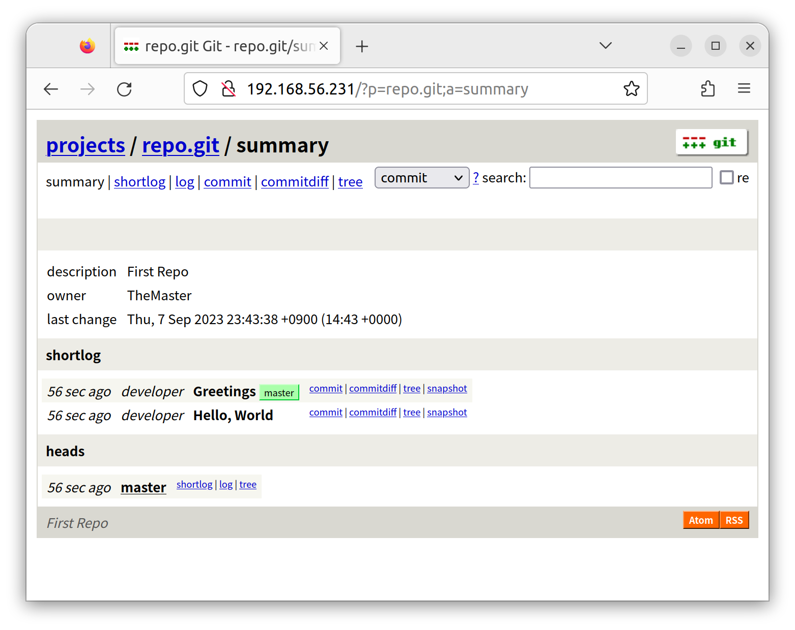

# gitweb

- book: [Git on the Server](https://git-scm.com/book/en/v2/Git-on-the-Server-GitWeb)
- arch wiki: [Gitweb](https://wiki.archlinux.org/title/gitweb)

## Install Manually

Clone the Git repo:

```bash
git clone https://github.com/git/git.git
```

Generate the CGI script:

```bash
cd git
make GITWEB_PROJECTROOT="/srv/git" prefix=/usr gitweb

GIT_VERSION = 2.42.0.122.g1fc548b2d6
    GEN gitweb/gitweb.cgi
    GEN gitweb/static/gitweb.js
```

Copy scirpts:

```bash
sudo cp -Rf gitweb /var/www/
```

```bash
/var/www/gitweb
├── GITWEB-BUILD-OPTIONS
├── INSTALL
├── Makefile
├── README
├── gitweb.cgi
├── gitweb.perl
└── static
    ├── git-favicon.png
    ├── git-logo.png
    ├── gitweb.css
    ├── gitweb.js
    └── js
        ├── README
        ├── adjust-timezone.js
        ├── blame_incremental.js
        ├── javascript-detection.js
        └── lib
            ├── common-lib.js
            ├── cookies.js
            └── datetime.js
```

### Nginx

```bash
sudo apt update
sudo apt install nginx fcgiwrap libcgi-pm-perl
```

Create a configuration:

```bash
sudo rm /etc/nginx/site-enabled/default
sudo vi /etc/nginx/site-enabled/git.conf
```

```lua
server {
    listen 80;
    listen [::]:80;

    server_name repo.git;

    root /var/www/gitweb;

    location /gitweb.cgi {
        include fastcgi_params;
        gzip off;
        fastcgi_param   SCRIPT_FILENAME  /var/www/gitweb/gitweb.cgi;
        fastcgi_param   GITWEB_CONFIG  /etc/gitweb.conf;
        fastcgi_pass    unix:/var/run/fcgiwrap.socket;
    }

    location / {
        index gitweb.cgi;
    }
}
```

Start Nginx service:

```bash
sudo service nginx restart
```

## Init

### Create a bare repository

make some commits:

```bash
mkdir -p /srv/git
git init --bare /srv/git/repo.git
chown -R $USER:$USER /srv/git/repo.git

cd /srv/git/repo.git
touch git-daemon-export-ok
echo "First Repo" > description
echo -e "[gitweb]\n\towner = TheMaster" >> config
```

## Make commits

```bash
git clone /srv/git/repo.git
cd repo

cat <<EOF >> main.c
#include <stdio.h>
int main() {
   printf("Hello, World!");
   return 0;
}
EOF
git add main.c
git commit -m "Hello, World"

sed -i 's/Hello, World!/안녕하세요./g' main.c
git add main.c
git commit -m "Greetings"

git checkout -b master
git push -u origin master
```

---

## Preview

### Home


### Repository



### Commit Diff


