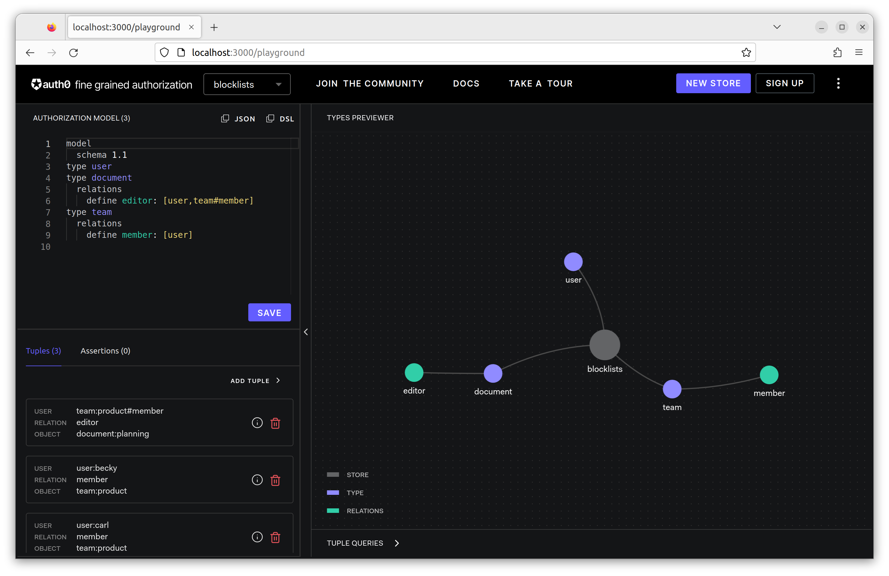
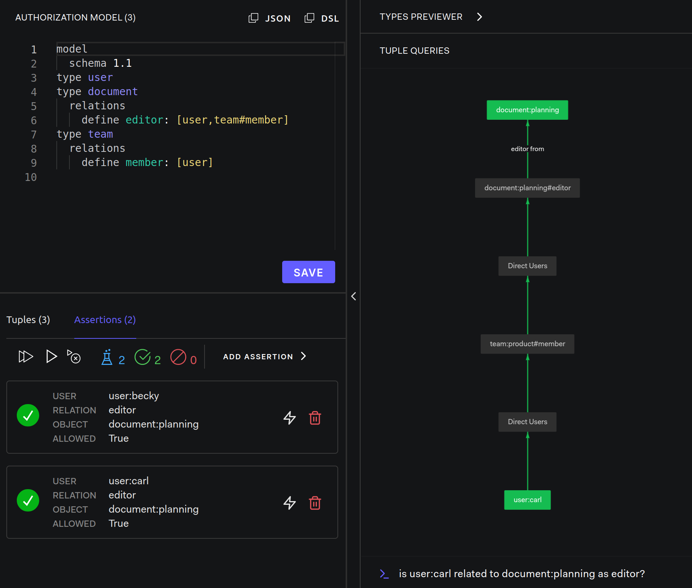
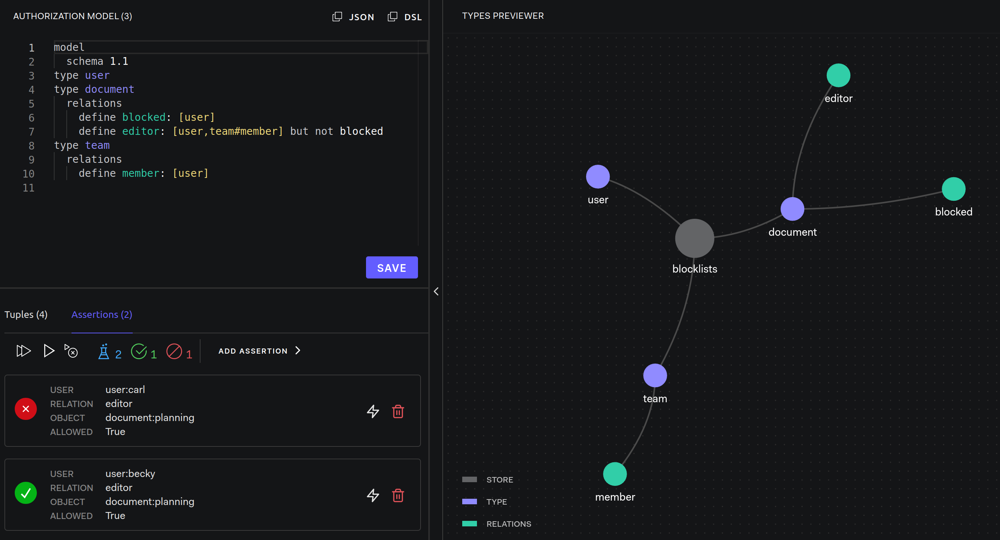

# Blocklists

Modeling Guides: [Blocklists](https://openfga.dev/docs/modeling/blocklists)

## Setup OpenFGA

- OpenFGA: [server](../../server/README.md)

```dsl
model
  schema 1.1
type user
type document
  relations
    define editor: [user,team#member]
type team
  relations
    define member: [user]
```



## Step by Step

### Check relationships



### Blocked Can No Longer Edit The Document

```dsl
model
  schema 1.1
type user
type document
  relations
    define blocked: [user]
    define editor: [user,team#member] but not blocked
type team
  relations
    define member: [user]
```

### Carl now blocked

```js
{ user: 'user:carl', relation: 'blocked', object: 'document:planning'}
```


