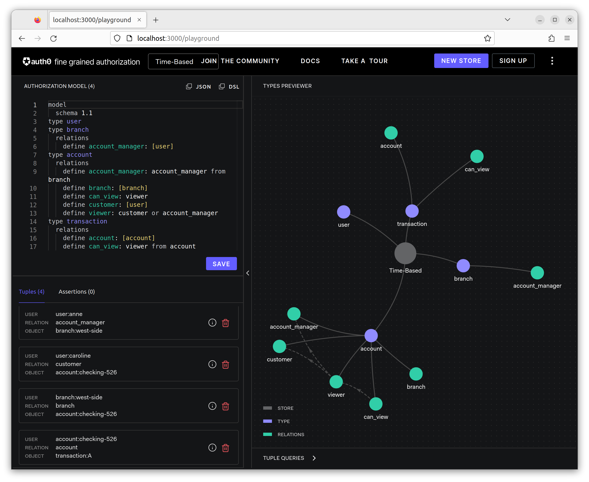
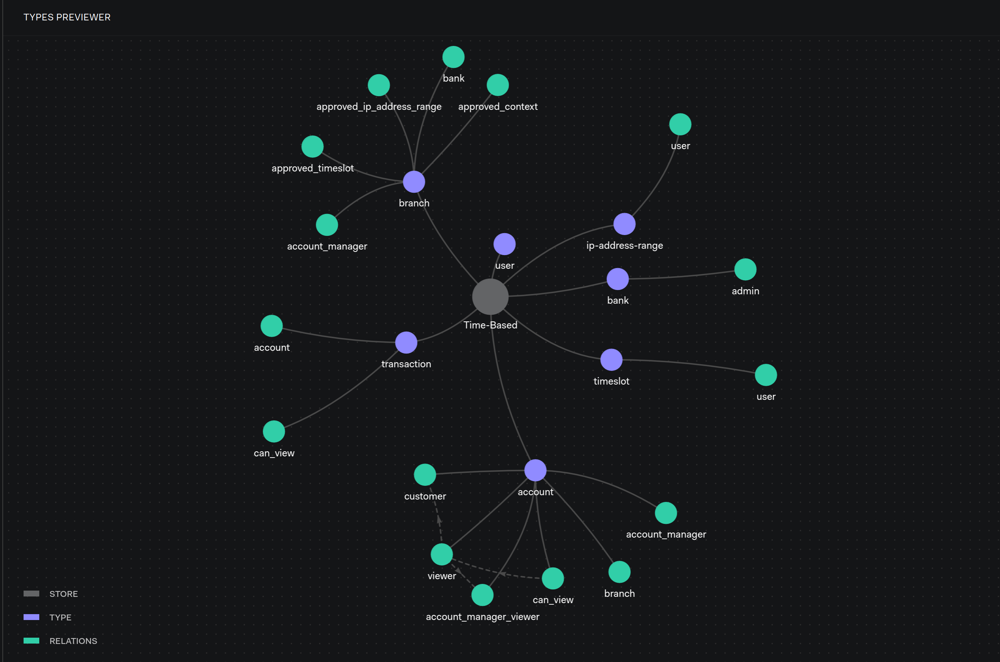

# Contextual and Time-Based Authorization

Modeling Guides: [Contextual and Time-Based Authorization](https://openfga.dev/docs/modeling/contextual-time-based-authorization)

## Setup OpenFGA

- OpenFGA: [server](../../server/README.md)

```dsl
model
  schema 1.1
type user
type branch
  relations
    define account_manager: [user]
type account
  relations
    define branch: [branch]
    define account_manager: account_manager from branch
    define customer: [user]
    define viewer: customer or account_manager
    define can_view: viewer
type transaction
  relations
    define account: [account]
    define can_view: viewer from account
```

```js
// Anne is the Account Manager at the West-Side branch
{ user: 'user:anne', relation: 'account_manager', object: 'branch:west-side'},
// Caroline is the customer for checking account number 526
{ user: 'user:caroline', relation: 'customer', object: 'account:checking-526'},
// The West-Side branch is the branch that the Checking account number 526 has been created at
{ user: 'branch:west-side', relation: 'branch', object: 'account:checking-526'},
// Checking account number 526 is the account for transaction A
{ user: 'account:checking-526', relation: 'account', object: 'transaction:A'}
```



## Step by Step

### Final Model



```dsl
model
  schema 1.1
type user
type bank
  relations
    define admin: [user]
type branch
  relations
    define bank: [bank]
    define account_manager: [user]
    define approved_ip_address_range: [ip-address-range]
    define approved_timeslot: [timeslot]
    define approved_context: user from approved_timeslot and user from approved_ip_address_range
type account
  relations
    define branch: [branch]
    define account_manager: account_manager from branch
    define customer: [user]
    define account_manager_viewer: account_manager and approved_context from branch
    define viewer: customer or account_manager_viewer
    define can_view: viewer
type transaction
  relations
    define account: [account]
    define can_view: viewer from account
type timeslot
  relations
    define user: [user]
type ip-address-range
  relations
    define user: [user]
```
