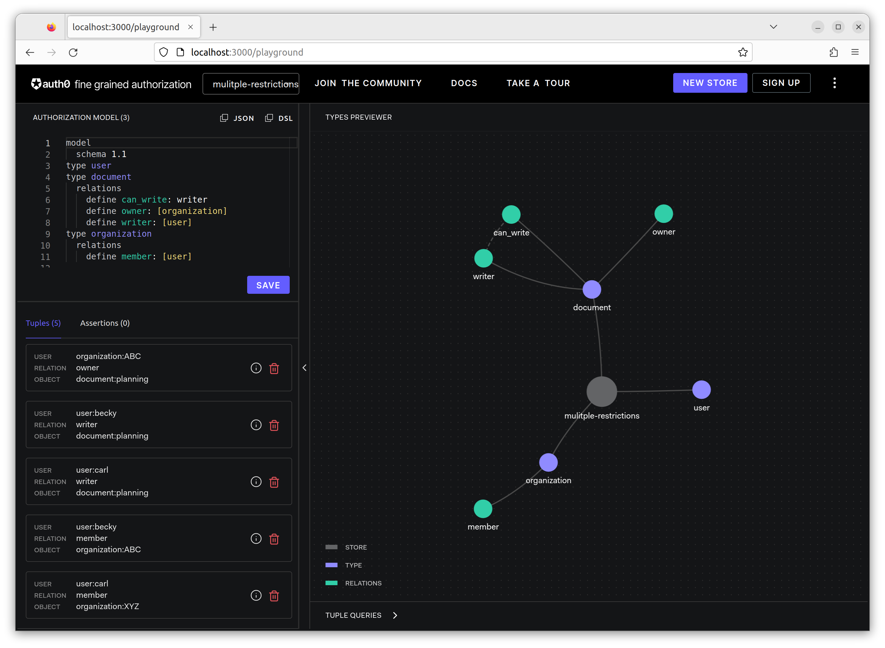
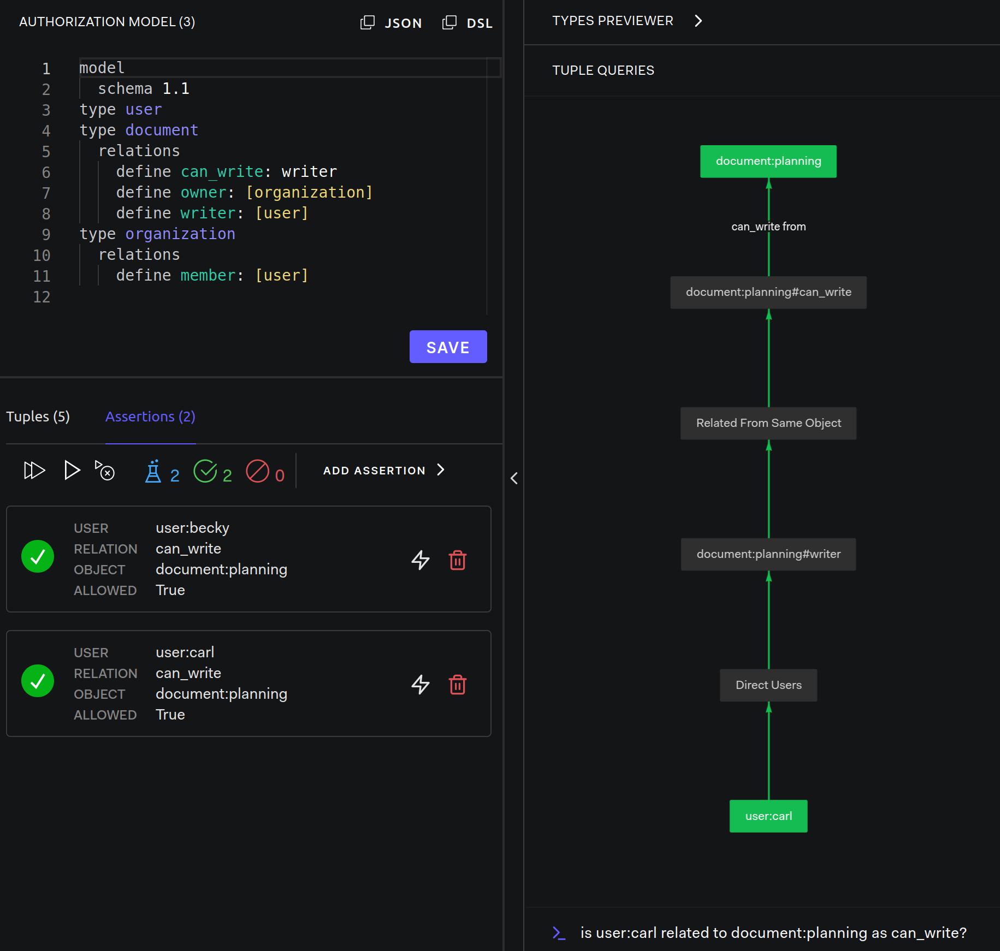
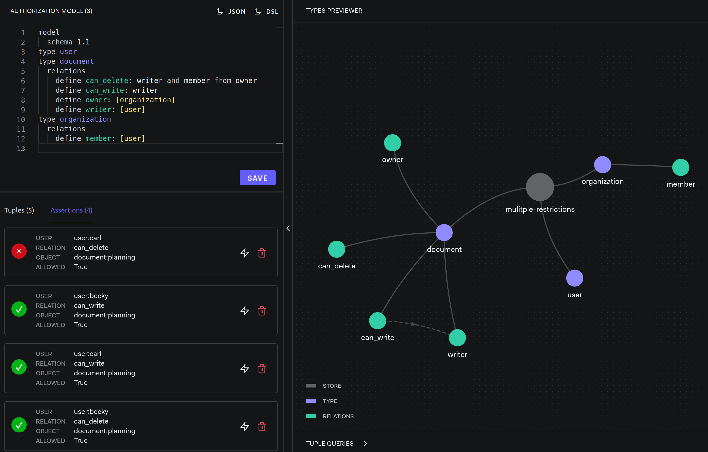

# Multiple Restrictions

Modeling Guides: [Multiple Restrictions](https://openfga.dev/docs/modeling/multiple-restrictions)

## Setup OpenFGA

- OpenFGA: [server](../../server/README.md)

```dsl
model
  schema 1.1
type user
type document
  relations
    define owner: [organization]
    define writer: [user]
    define can_write: writer
type organization
  relations
    define member: [user]
```



- **organization ABC** is the **owner** of **planning document**
- **Becky** is a **writer** to the **planning document**
- **Carl** is a **writer** to the **planning document**
- **Becky** is a **member** of the **organization ABC**
- **Carl** is a **member** of the **organization XYZ**

## Step by Step

### Users can write



### Add can_delete

```dsl
model
  schema 1.1
type user
type document
  relations
    define owner: [organization]
    define writer: [user]
    define can_write: writer
    define can_delete: writer and member from owner
type organization
  relations
    define member: [user]
```

### Check relationships



However, **Carl** **cannot delete** the **planning document** because although he is a writer, Carl is **not a member of organization:ABC** that owns the planning document.
