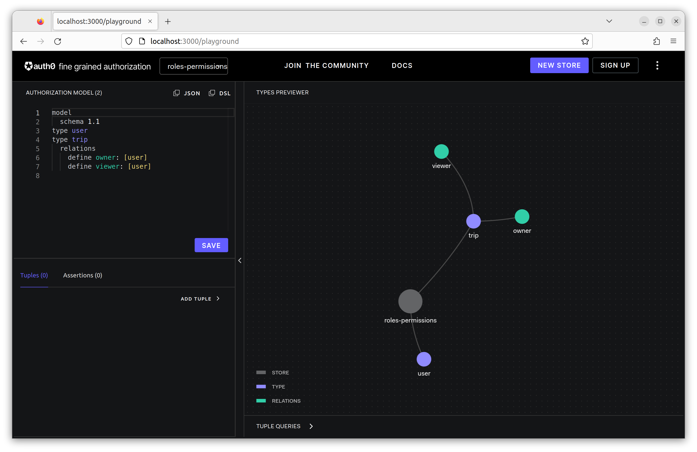
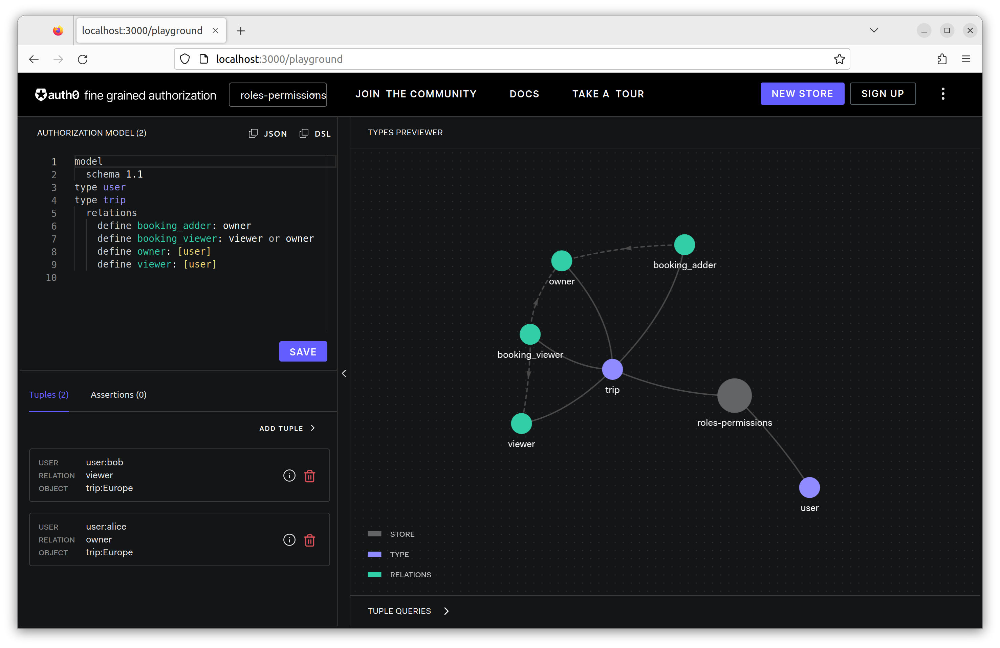
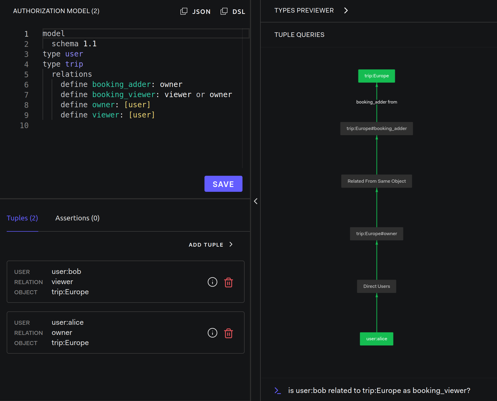
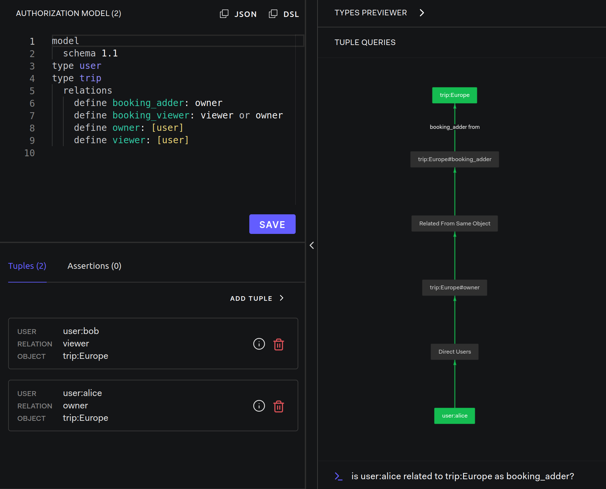
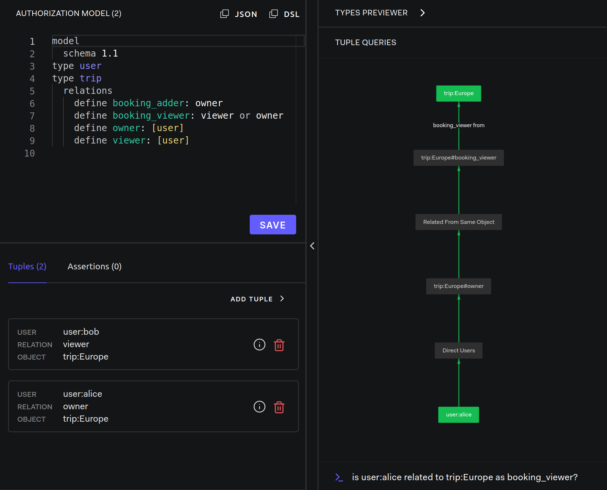

# Roles and Permissions

Modeling Guides: [Roles and Permissions](https://openfga.dev/docs/modeling/roles-and-permissions)

- More fine grained permissions
  - 좀더 세분화된 역할 및 권한 부여
- No code changes in your application
  - 애플리케이션 코드 변경 없이 역할 및 권한 설정 변경 가능

## Setup OpenFGA

- OpenFGA: [server](../../server/README.md)

### DSL

1. Create a new store: `roles-permissions`
2. Edit DSL:

```dsl
model
  schema 1.1
type user
type trip
  relations
    define owner: [user]
    define viewer: [user]
```



사용자는 `owner`이거나 `viewer`일 것이다.

## Step by Step

### Adding Permissions For Bookings

- 사용자의 권한은 직접적으로 표현하지 않는다.
- 새로운 관계들을 만들어서 암시적으로 권한을 생성한다.

```dsl
model
  schema 1.1
type user
type trip
  relations
    define owner: [user]
    define viewer: [user]
    define booking_adder: owner
    define booking_viewer: viewer or owner
```

- 예약을 볼 수 있는 사용자: `viewer`, `owner`
- 예약을 관리할 수 있는 사용자: `owner`

#### 직접 관계를 만드는 것과 비교

```dsl
type user
type trip
  relations
    define owner: [user,user:*,team#owner]
    define viewer: [user,user:*,team#viewer]
type team
  relations
    define owner: [user]
    define viewer: [user]
```

### Checking User Roles And Their Permissions

- 사용자 bob을 `trip:Europe`의 `viewer`로 추가한다.
- 사용자 alice는 `trip:Europe`의 `owner`로 추가한다.

```js
// Add bob as viewer on trip:Europe
{ user: 'user:bob', relation: 'viewer', object: 'trip:Europe'},
// Add alice as owner on trip:Europe
{ user: 'user:alice', relation: 'owner', object: 'trip:Europe'}
```



#### Is bob allowed to view bookings on trip Europe?

```text
is user:bob related to trip:Europe as booking_viewer?
```



#### Is alice allowed to view and add bookings on trip Europe?

```text
is user:alice related to trip:Europe as booking_adder?
is user:alice related to trip:Europe as booking_viewer?
```



