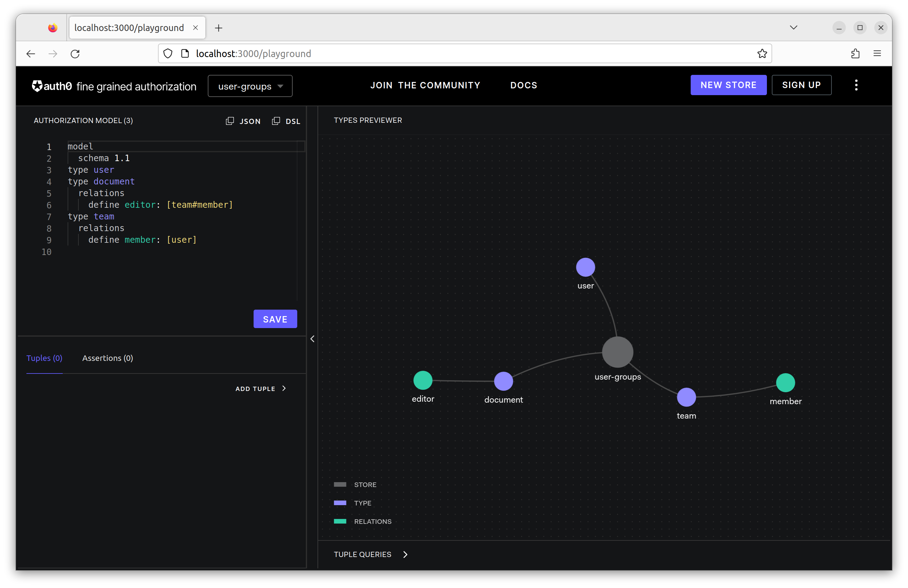
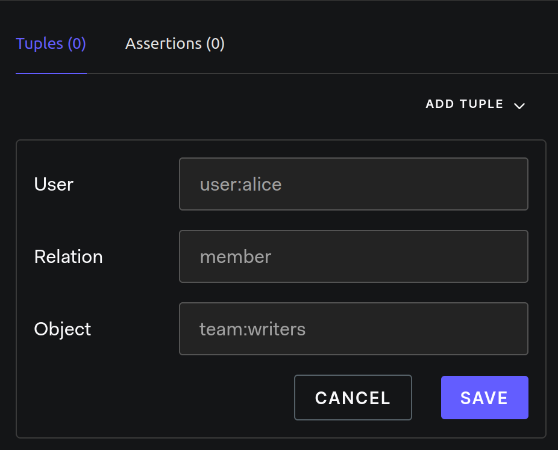
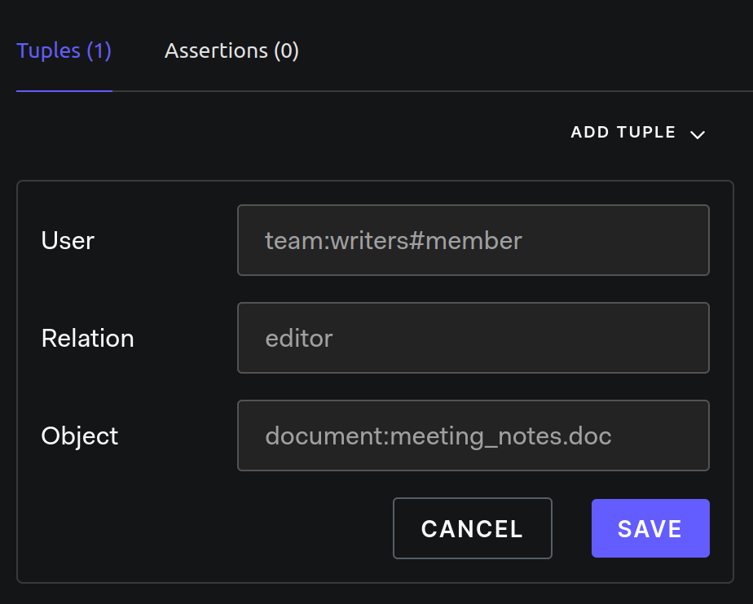
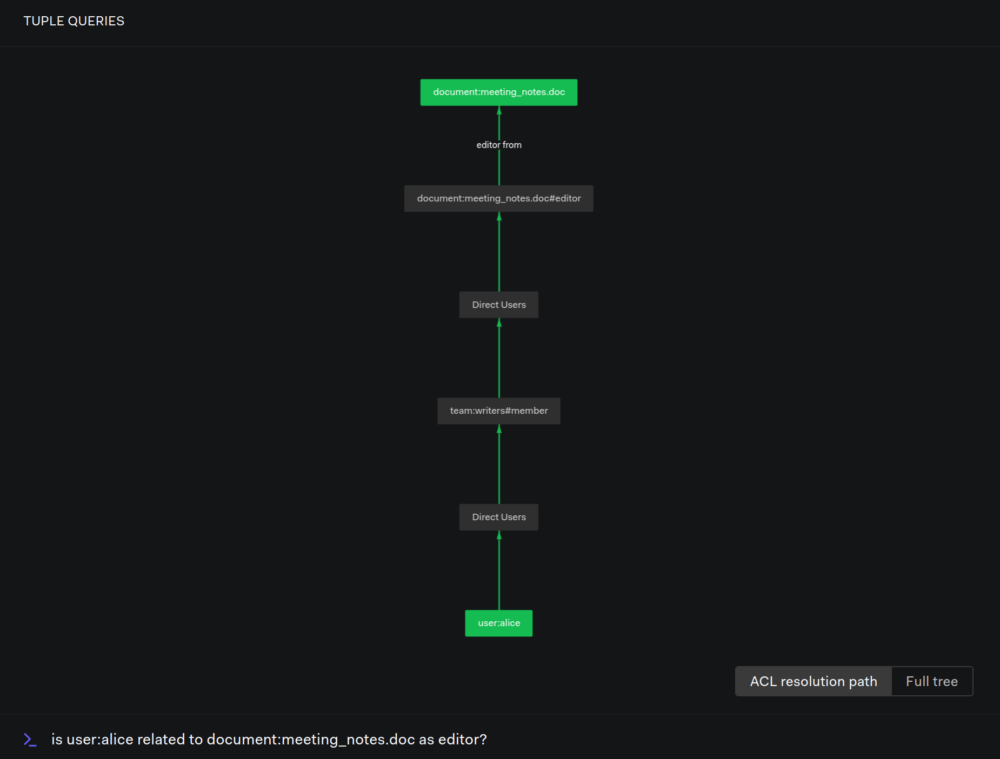

# User Groups

Modeling Guides: [User Groups](https://openfga.dev/docs/modeling/user-groups)

## Setup OpenFGA

- OpenFGA: [server](../../server/README.md)

### DSL

1. Create a new store: `user-groups`
2. Edit DSL:

```dsl
model
  schema 1.1
type user
type document
  relations
    define editor: [team#member]
type team
  relations
    define member: [user]
```



## Step by Step

### Add Users As Members To The Team

alice는 writers 팀의 멤버다:

```js
{ user: 'user:alice', relation: 'member', object: 'team:writers'}
```



### Assign The Team Members A Relation To An Object

writers 팀의 멤버는 meeting_notes.doc 문서를 수정할 수 있다:

```js
{ user: 'team:writers#member', relation: 'editor', object: 'document:meeting_notes.doc'}
```



### Checking An Individual Member's Access To An Object

alice가 meeting_notes.doc 문서를 수정할 수 있는지 확인:

```text
is user:alice related to document:meeting_notes.doc as editor?
```

```js
{
  user: 'user:alice',
  relation: 'editor',
  object: 'document:meeting_notes.doc',
}
```


