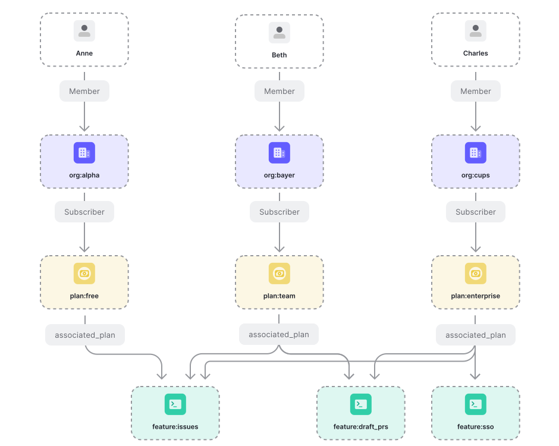

# Entitlements

Use Cases: [Modeling Entitlements for a System with OpenFGA](https://openfga.dev/docs/modeling/advanced/entitlements)



```dsl
model
  schema 1.1
type user
type feature
  relations
    define associated_plan: [plan]
    define access: [user] or subscriber_member from associated_plan
type plan
  relations
    define subscriber: [organization]
    define subscriber_member: member from subscriber
type organization
  relations
    define member: [user]
```
