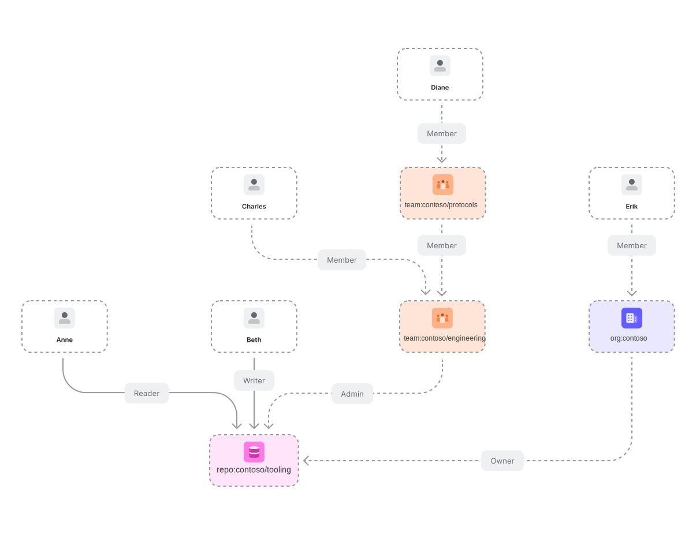

# GitHub

Use Cases: [Modeling GitHub permissions with OpenFGA](https://openfga.dev/docs/modeling/advanced/github)



```dsl
model
  schema 1.1
type user
type repo
  relations
    define admin: [user,team#member,organization#member] or admin from owner
    define maintainer: [user,team#member,organization#member] or admin
    define writer: [user,team#member,organization#member] or maintainer or writer from owner
    define triager: [user,team#member,organization#member] or writer
    define reader: [user,team#member,organization#member] or triager or reader from owner
    define owner: [organization]
type organization
  relations
    define owner: [organization]
    define repo_admin: [user,team#member,organization#member]
```
