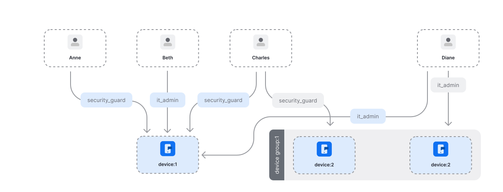

# IoT

Use Cases: [Modeling Authorization for an IoT Security System with OpenFGA](https://openfga.dev/docs/modeling/advanced/iot)



```dsl
model
  schema 1.1
type user
type device
  relations
    define it_admin: [user,device_group#it_admin]
    define security_guard: [user,device_group#security_guard]
    define live_video_viewer: [user] or it_admin or security_guard
    define recorded_video_viewer: [user] or it_admin or security_guard
    define device_renamer: [user] or it_admin
type device_group
  relations
    define it_admin: [user]
    define security_guard: [user]
```
