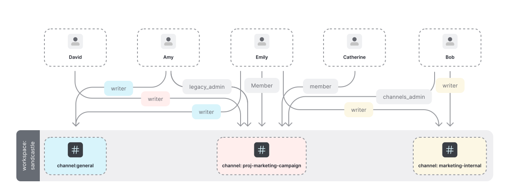

# Slack

Use Cases: [Modeling Authorization for Slack with OpenFGA](https://openfga.dev/docs/modeling/advanced/slack)



```dsl
model
  schema 1.1
type user
type workspace
  relations
    define legacy_admin: [user]
    define channels_admin: [user] or legacy_admin
    define member: [user] or channels_admin or legacy_admin
    define guest: [user]
type channel
  relations
    define parent_workspace: [workspace]
    define writer: [user,workspace#legacy_admin,workspace#channels_admin,workspace#member,workspace#guest]
    define viewer: [user,workspace#legacy_admin,workspace#channels_admin,workspace#member,workspace#guest] or writer
```
