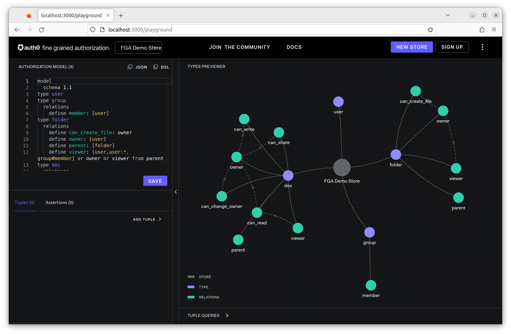

# SDK Client

[Install SDK Client](https://openfga.dev/docs/getting-started/install-sdk)

## with Go

- [openfga/go-sdk](https://github.com/openfga/go-sdk)

### dotenv

Add: [.env](.env)

```bash
FGA_API_SCHEME="http"
FGA_API_HOST="localhost"
```

### Create a Store

- store: contains authorization data

```bash
mkdir create_store
cd create_store
go mod init create_store
go get -u github.com/openfga/go-sdk
go get -u github.com/joho/godotenv
cd ..
```

#### Init a workspace

```bash
go work init create_store
```

#### Store code

[create_store/main.go](create_store/main.go)

```go
package main

import (
 "context"
 "fmt"
 "os"

 _ "github.com/joho/godotenv/autoload"
 openfga "github.com/openfga/go-sdk"
)

func main() {
 configuration, err := openfga.NewConfiguration(openfga.Configuration{
  ApiScheme: os.Getenv("FGA_API_SCHEME"), // optional, defaults to "https"
  ApiHost:   os.Getenv("FGA_API_HOST"),   // required, define without the scheme (e.g. api.openfga.example instead of https://api.openfga.example)
 })

 if err != nil {
  // .. Handle error
 }

 apiClient := openfga.NewAPIClient(configuration)

 store, _, err := apiClient.OpenFgaApi.CreateStore(context.Background()).Body(openfga.CreateStoreRequest{
  Name: "FGA Demo Store",
 }).Execute()
 if err != nil {
  // .. Handle error
 }

 fmt.Printf("storeId %s\n", *store.Id)
}
```

```bash
go run create_store

storeId 01GS5G4GBJ342PADA3Z9NMES3E
```

Add: [.env](.env)

```bash
FGA_API_SCHEME="http"
FGA_API_HOST="localhost"
FGA_STORE_ID="01GS5G4GBJ342PADA3Z9NMES3E"
```

Open: [localhost:3000/playground](http://localhost:3000/playground)



### Configure Authorization Model for a Store

DSL:

```dsl
model
  schema 1.1
type user
type document
  relations
    define reader: [user]
    define writer: [user]
    define owner: [user]
```

```bash
mkdir auth_model
cd auth_model
go mod init auth_model
go get -u github.com/openfga/go-sdk
go get -u github.com/joho/godotenv
cd ..
go work use ./auth_model
```

invoke the write authorization models API: [auth_model/main.go](auth_model/main.go)

```bash
go run auth_model
```

```bash
AuthorizationModelId 01GS5G5662KBME04PN60A4DN5B
```

Open: [localhost:3000/playground](http://localhost:3000/playground)


### Update Relationship Tuples

```js
{
  user: 'user:anne',
  relation: 'reader',
  object: 'document:Z',
}
```

#### Calling Write API To Add New Relationship Tuples

```bash
mkdir update_relationship
cd update_relationship
go mod init update_relationship
go get -u github.com/openfga/go-sdk
go get -u github.com/joho/godotenv
cd ..
go work use ./update_relationship
```

[update_relationship/main.go](update_relationship/main.go)

```js
await fgaClient.write({
  writes: {
    tuple_keys: [
      { user: 'user:anne', relation: 'reader', object: 'document:Z'}
    ]
  },
  authorization_model_id: "01GS5G5662KBME04PN60A4DN5B" 
});
```

```bash
go run update_relationship
```

Open: [localhost:3000/playground](http://localhost:3000/playground)


#### Calling Check API

```bash
mkdir check
cd check
go mod init check
go get -u github.com/openfga/go-sdk
go get -u github.com/joho/godotenv
cd ..
go work use ./check
```

[check/main.go](check/main.go)

```bash
go run check

allowed true
```

Open: [localhost:3000/playground](http://localhost:3000/playground)


