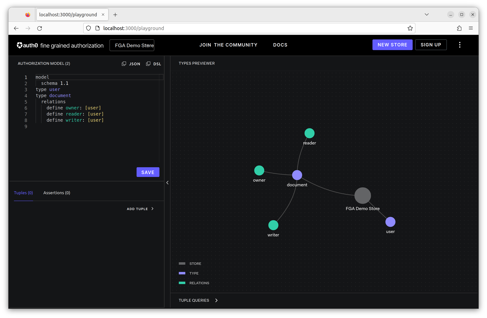
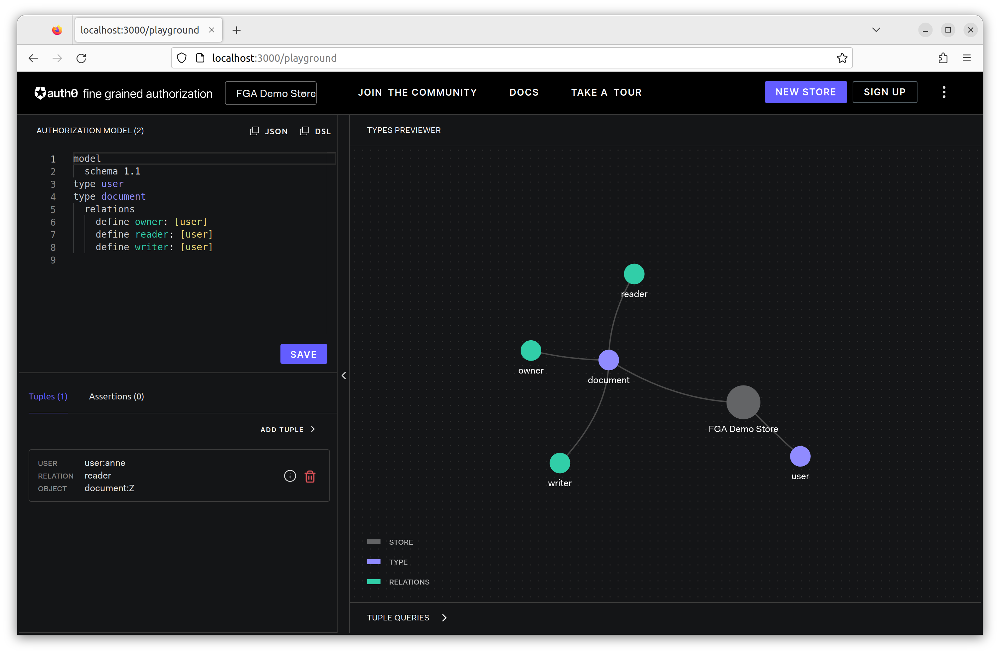
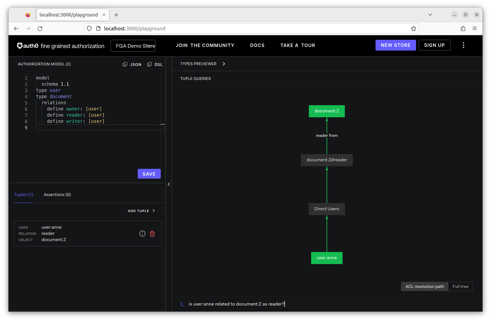

# SDK Client

[Install SDK Client](https://openfga.dev/docs/getting-started/install-sdk)

## with Node

- [openfga/js-sdk](https://github.com/openfga/js-sdk)

```bash
yarn init
yarn add @openfga/sdk
```

### dotenv

```bash
yarn add dotenv
```

Add: [.env](.env)

```bash
FGA_API_SCHEME="http"
FGA_API_HOST="localhost"
```

### Create a Store

- store: contains authorization data

[create_store.js](create_store.js)

```js
import * as dotenv from "dotenv";
dotenv.config();

import { OpenFgaApi } from "@openfga/sdk";

const openFga = new OpenFgaApi({
  apiScheme: process.env.FGA_API_SCHEME, // optional, defaults to "https"
  apiHost: process.env.FGA_API_HOST, // required, define without the scheme (e.g. api.openfga.example instead of https://api.openfga.example)
});

const { id: storeId } = await openFga.createStore({
  name: "FGA Demo Store",
});

console.log("storeId", storeId);
```

```bash
node create_store.js

storeId 01GS2XYH0K1DPPGB1J9VRMGVCM
```

Add: [.env](.env)

```bash
FGA_API_SCHEME="http"
FGA_API_HOST="localhost"
FGA_STORE_ID="01GS2XYH0K1DPPGB1J9VRMGVCM"
```

Open: [localhost:3000/playground](http://localhost:3000/playground)

### Configure Authorization Model for a Store

DSL:

```dsl
model
  schema 1.1
type user
type document
  relations
    define reader: [user]
    define writer: [user]
    define owner: [user]
```

invoke the write authorization models API: [auth_model.js](auth_model.js)

```bash
node auth_model.js

authorization_model_id 01GS2Y8QT2M6PM445QJMS8EBJF
```

Open: [localhost:3000/playground](http://localhost:3000/playground)



### Update Relationship Tuples

```js
{
  user: 'user:anne',
  relation: 'reader',
  object: 'document:Z',
}
```

#### Calling Write API To Add New Relationship Tuples

[update_relationship.js](update_relationship.js)

```js
await fgaClient.write({
  writes: {
    tuple_keys: [
      { user: 'user:anne', relation: 'reader', object: 'document:Z'}
    ]
  },
  authorization_model_id: "01GS2Y8QT2M6PM445QJMS8EBJF" 
});
```

```bash
node update_relationship.js
```

Open: [localhost:3000/playground](http://localhost:3000/playground)



#### Calling Check API

[check.js](check.js)

```js
const { allowed } = await fgaClient.check({
  authorization_model_id: '01GS2Y8QT2M6PM445QJMS8EBJF',
  tuple_key: {
    user: 'user:anne',
    relation: 'reader',
    object: 'document:Z',
  },
});
```

```bash
node check.js

allowed true
```

Open: [localhost:3000/playground](http://localhost:3000/playground)


