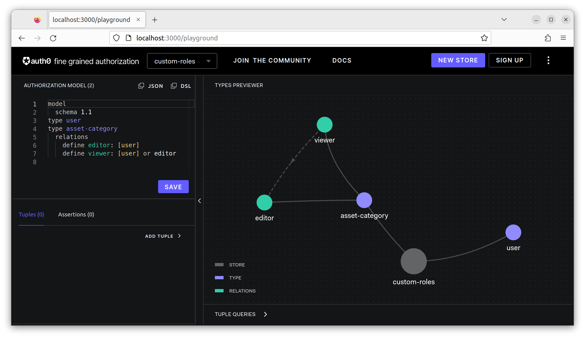
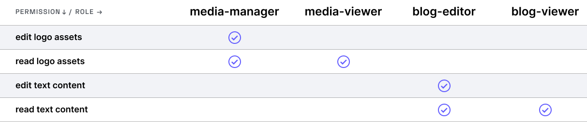
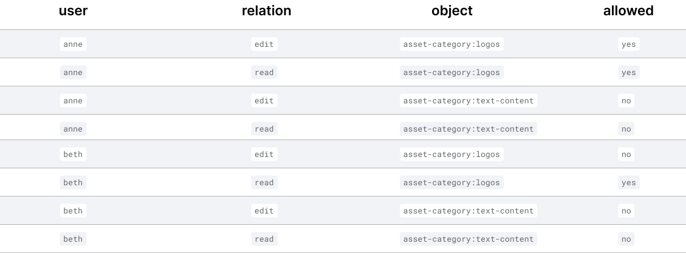
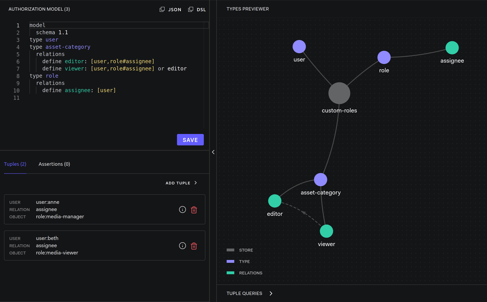
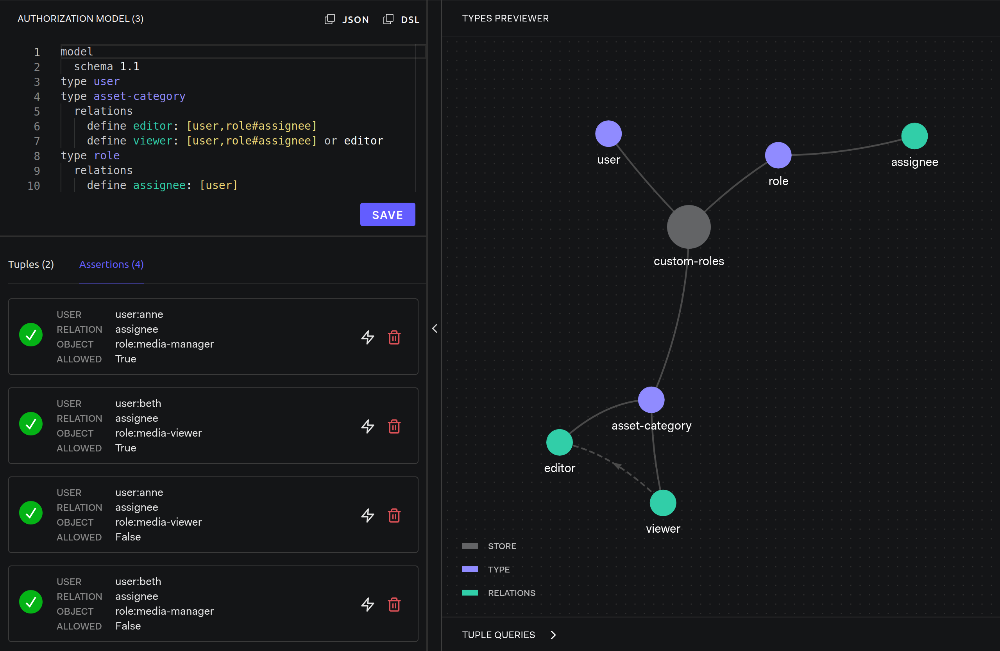

# Custom Roles

Modeling Guides: [Custom Roles](https://openfga.dev/docs/modeling/custom-roles)

## Setup OpenFGA

- OpenFGA: [server](../../server/README.md)

```dsl
model
  schema 1.1
type user
type asset-category
  relations
    define viewer: [user] or editor
    define editor: [user]
```



### Custom Roles and Permissions



### Expected results



## Step by Step

### Update The Authorization Model To Add A Role Type

```dsl
model
  schema 1.1
type user
type asset-category
  relations
    define viewer: [user,role#assignee] or editor
    define editor: [user,role#assignee]
type role
  relations
    define assignee: [user]
```

```js
// Anne is assigned the media-manager role
{ user: 'user:anne', relation: 'assignee', object: 'role:media-manager'},
// Beth is assigned the media-viewer role
{ user: 'user:beth', relation: 'assignee', object: 'role:media-viewer'}
```



#### Verify relationships



### Use Relationship Tuples To Associate Permissions With The Roles

```js
// Users assigned the media-manager role can edit in the Logos assets category
{ user: 'role:media-manager#assignee', relation: 'editor', object: 'asset-category:logos'},
// Users assigned the media-viewer role can view from the Logos assets category
{ user: 'role:media-viewer#assignee', relation: 'viewer', object: 'asset-category:logos'}
```

#### Verify relationships


