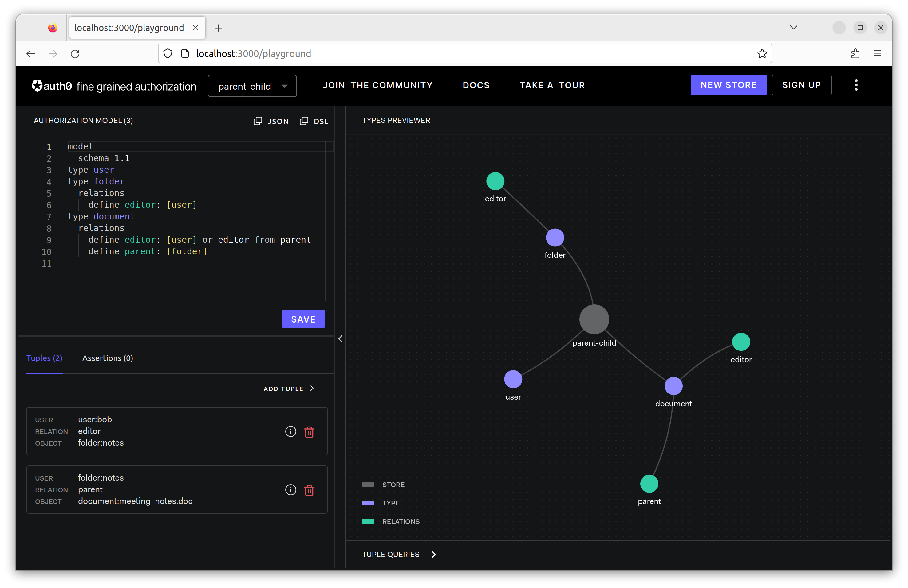
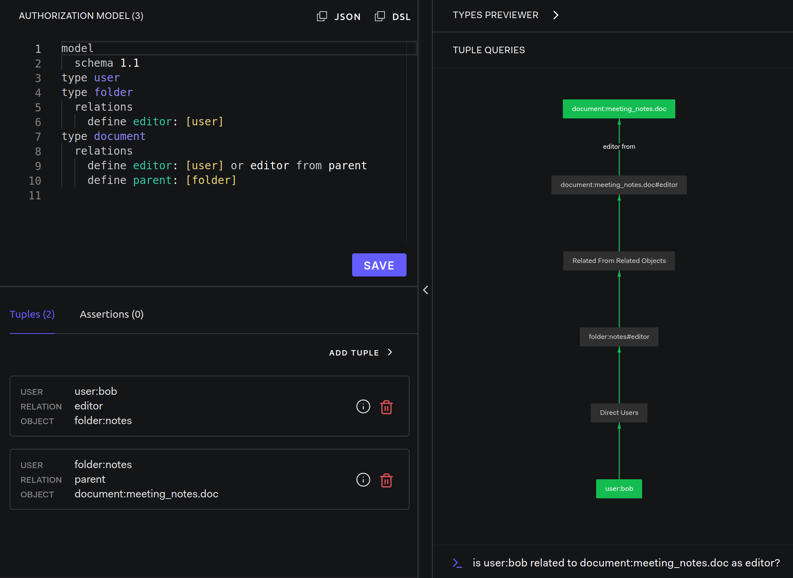

# Parent-Child

Modeling Guides: [Parent-Child](https://openfga.dev/docs/modeling/parent-child)

## Setup OpenFGA

- OpenFGA: [server](../../server/README.md)



## Step by Step

### Check To See If bob Is An Editor Of document:meeting_notes.doc

```text
is user:bob related to document:meeting_notes.doc as editor?
```


