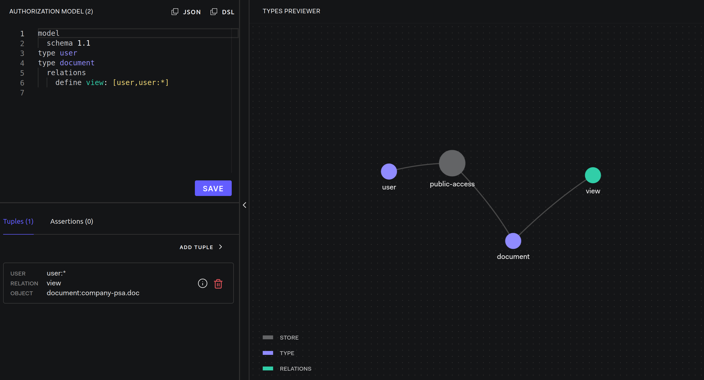

# Public Access

Modeling Guides: [Public Access](https://openfga.dev/docs/modeling/public-access)

## Setup OpenFGA

- OpenFGA: [server](../../server/README.md)

```dsl
model
  schema 1.1
type user
type document
  relations
    define view: [user,user:*]
```



## Step by Step

### Check relationships


