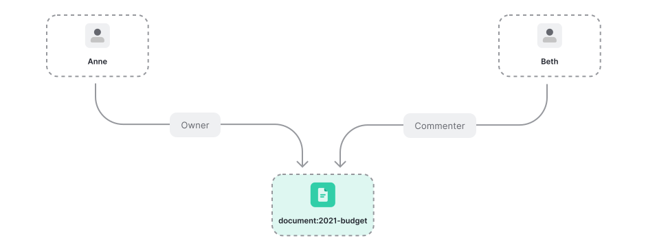
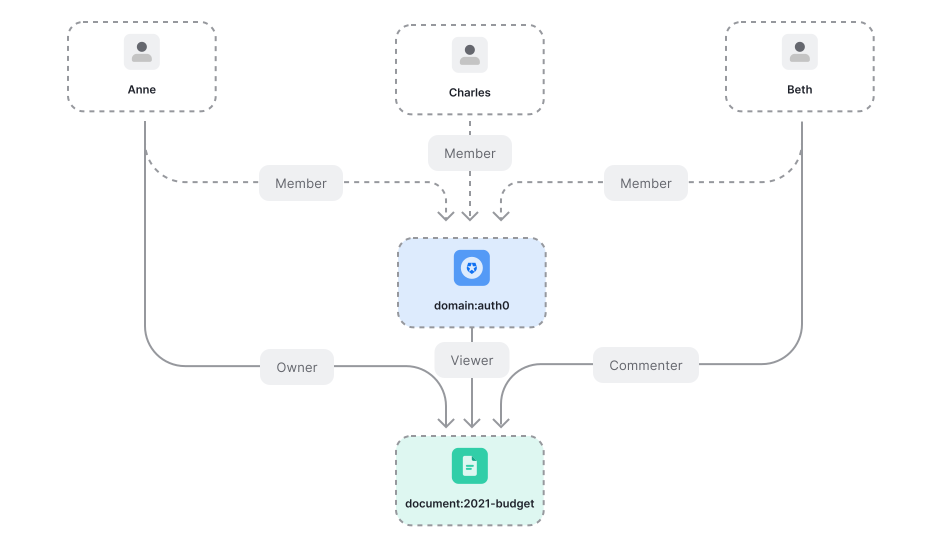
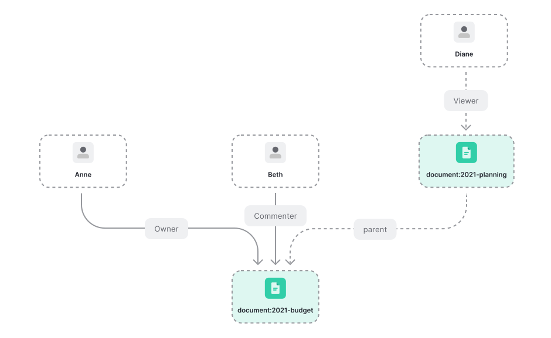
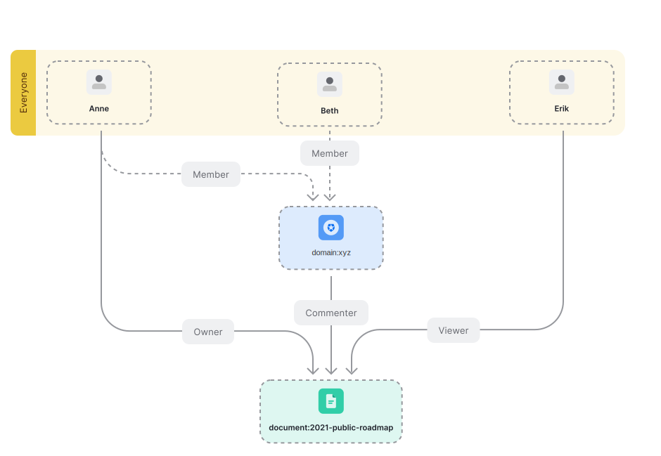

# Google Drive

Use Cases: [Modeling Google Drive permissions with OpenFGA](https://openfga.dev/docs/modeling/advanced/gdrive)

## Step by Step

### Individual Permissions



```dsl
model
  schema 1.1
type user
type document
  relations
    define owner: [user]
    define writer: [user] or owner
    define commenter: [user] or writer
    define viewer: [user] or commenter
```

### Organization Permissions



```dsl
model
  schema 1.1
type user
type document
  relations
    define owner: [user,domain#member]
    define writer: [user,domain#member] or owner
    define commenter: [user,domain#member] or writer
    define viewer: [user,domain#member] or commenter
type domain
  relations
    define member: [user]
```

### Folder Permission Propagation



```dsl
model
  schema 1.1
type user
type document
  relations
    define owner: [user,domain#member] or owner from parent
    define writer: [user,domain#member] or owner or writer from parent
    define commenter: [user,domain#member] or writer or commenter from parent
    define viewer: [user,domain#member] or commenter or viewer from parent
    define parent: [document]
type domain
  relations
    define member: [user]
```

### Sharing Files And Folders Publicly



```dsl
model
  schema 1.1
type user
type document
  relations
    define owner: [user,domain#member] or owner from parent
    define writer: [user,domain#member] or owner or writer from parent
    define commenter: [user,domain#member] or writer or commenter from parent
    define viewer: [user,user:*,domain#member] or commenter or viewer from parent
    define parent: [document]
type domain
  relations
    define member: [user]
```
